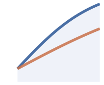

Every protocol decision starts here.

<table>
<tr>
<td width="120"></td>
<td>
<a href="01-active-lp"><strong>Live Liquidity for LMSR Prediction Markets</strong></a> 
LMSR markets typically lock liquidity to a single sponsor. This paper opens them to live LP entry with prospective fees, reserve-based settlement, and calibrated residual weighting that narrows late-entry advantage to near zero across comprehensive simulations.
</td>
</tr>
<tr>
<td width="120"></td>
<td>
<a href="02-trust-explicit-resolution"><strong>Trust-Explicit Resolution for Prediction Markets</strong></a> 
Most prediction markets resolve outcomes opaquely. This paper commits each market to an executable resolution blueprint at creation, producing challengeable evidence traces, with dispute economics where bonds scale with pool value and verification coverage matters more than adjudicator quality.
</td>
</tr>
<tr>
<td width="120"></td>
<td>
<a href="03-verified-execution"><strong>Verified Execution for Trust-Explicit Resolution</strong></a> 
A resolver can claim they ran a declared blueprint without actually doing so. Progressive verification narrows that gap: Merkle-pinned traces that make fabrication detectable, hardware-attested runners that bind execution to measured code, and a two-axis model separating resolution type from execution assurance.
</td>
</tr>
<tr>
<td width="120"></td>
<td>
<a href="04-general-intelligence-benchmark"><strong>An Unbiased Benchmark for General Intelligence</strong></a> 
Static benchmarks get gamed once they matter: agents memorize, overfit, and saturate fixed test sets. This paper argues that prediction markets are a stronger evaluation surface, where the target is future reality, bluffing costs capital, and the test evolves as participants discover new questions.
</td>
</tr>
</table>
